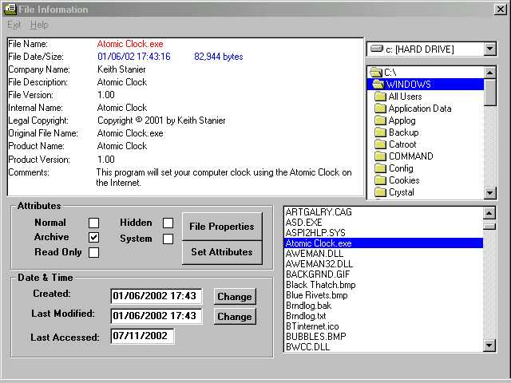



## FileInfo

### Description

This program will show all relevant information about a file. Attributes, Date and Time Created and Modified, Company Name, File Description, File Version, Internal Name, Legal Copyright, Original File Name, Product Name, Product Version, Comments and Properties. It allows you to change the Attributes, Date and Time for any file. Because PSC don't allow added Dll's you can download Apigid32.dll from: http://www.stevekaras.com/GB/custdownload.htm. If you like and use this code please give it a vote.
 
### More Info
 
Apigid32.dll needs to be placed in your Windows\System folder.

Allow you to change its attributes, Date and Time for any file.

             |
---                |---
**Submitted On**   |2001-11-07 17:00:00
**By**             |[Keith Stanier](https://github.com/Planet-Source-Code/PSCIndex/blob/master/ByAuthor/keith-stanier.md)
**Level**          |Intermediate
**User Rating**    |4.8 (29 globes from 6 users)
**Compatibility**  |VB 4\.0 \(32\-bit\), VB 5\.0, VB 6\.0
**Category**       |[Files/ File Controls/ Input/ Output](https://github.com/Planet-Source-Code/PSCIndex/blob/master/ByCategory/files-file-controls-input-output__1-3.md)
**World**          |[Visual Basic](https://github.com/Planet-Source-Code/PSCIndex/blob/master/ByWorld/visual-basic.md)
**Archive File**   |[FileInfo1535991282003\.zip](https://github.com/Planet-Source-Code/keith-stanier-fileinfo__1-40494/archive/master.zip)

